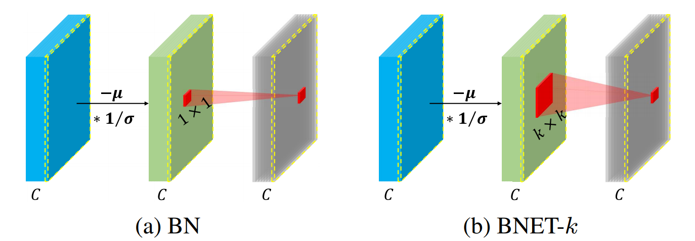

# Batch Normalization with Enhanced Linear Transformation

This repository provides the PyTorch implementation of [Batch Normalization with Enhanced Linear Transformation](https://arxiv.org/abs/2011.14150)

<div align="center">
  
</div>

## Update
- 11.27.2020: Pretrained models are released.
- 11.26.2020: The code of Image Classification and Object Detection are released.

## Models
- Classification:[[Google Drive]](https://drive.google.com/drive/folders/1lwyQgoKA-hf1EguT7zh8BgriM-B1LWQm?usp=sharing)

- Detection:[[Google Drive]](https://drive.google.com/drive/folders/1PgHChbHq6uI2RafFNhcWVHAMDOjua3QE?usp=sharing)

## Model Zoo

|    Backbone     |  BN  | Lr schd | Inf time (fps) | box AP | Download |
| :-------------: | :-------: | :-----: | :------------: | :----: | :------: |
|    Faster-R-50-FPN     |  BN  |   1x    |    18.0    | 37.5   | [model](http://download.openmmlab.com/mmdetection/v2.0/faster_rcnn/faster_rcnn_r50_fpn_1x_coco/faster_rcnn_r50_fpn_1x_coco_20200130-047c8118.pth) |
|    Faster-R-50-FPN     |  BNET-3  |   1x    |    17.1    | 39.5   | [model](https://drive.google.com/file/d/1htx41H6OgVpWEIeYfueSXv1nP5GSWJCu/view?usp=sharing) |
|    Faster-R-50-FPN     |  BNET-5  |   1x    |    16.3    | 40.1   | [model](https://drive.google.com/file/d/1z8Y1z7IY6a7HF8begjooNtcpYWlmkcc6/view?usp=sharing) |
|    Faster-R-50-FPN     |  BNET-5  |   3x    |    16.3    | 41.7   | [model](https://drive.google.com/file/d/1kvCFlVtNjwLW0WFIJ_9WvRADszVk5rCz/view?usp=sharing) |
|    Faster-R-50-FPN     |  BNET-7  |   1x    |    15.5    | 40.7   | [model](https://drive.google.com/file/d/1FrjSrLc2j3c5-Bxax6v7sKlnmNY2uHhu/view?usp=sharing) |
|    Faster-R-101-FPN     |  BN  |   1x    |    13.4    | 39.4   | [model](http://download.openmmlab.com/mmdetection/v2.0/faster_rcnn/faster_rcnn_r101_fpn_1x_coco/faster_rcnn_r101_fpn_1x_coco_20200130-f513f705.pth) |
|    Faster-R-101-FPN     |  BNET-3  |   1x    |    13.0    | 40.7   | [model](https://drive.google.com/file/d/11tDHDO0YtFILXt3h_YeghC-lImcAM4Vz/view?usp=sharing) |
|    Faster-R-101-FPN     |  BNET-5  |   1x    |    12.2    | 41.8   | [model](https://drive.google.com/file/d/1CEdiDMTWAnh2pEFRN3y57WE--uzGu8MC/view?usp=sharing) |
|    Faster-R-101-FPN     |  BNET-5  |   3x    |    12.2    | 43.1   | [model](https://drive.google.com/file/d/1zdSkCQ9DbtCkP0MHlNDbx0VLaxmNnpM-/view?usp=sharing) |

|    Backbone     |  BN  | Lr schd | Inf time (fps) | box AP | Download |
| :-------------: | :-----: | :-----: | :------------: | :----: | :------: |
|    Retina-R-101-FPN     |  BN  |   1x    |    12.8    | 38.5   | [model](http://download.openmmlab.com/mmdetection/v2.0/retinanet/retinanet_r101_fpn_1x_coco/retinanet_r101_fpn_1x_coco_20200130-7a93545f.pth) |
|    Retina-R-101-FPN     |  BNET-5  |   1x    |    11.4    | 40.7   | [model](https://drive.google.com/file/d/1t9cSGdQ8LStRVYWZ1U92l8ewrRJmHt7x/view?usp=sharing) |


|    Backbone     |  BN  | Lr schd |  box AP | mask AP | Download |
| :-------------: | :-----: | :-----: | :----: | :----: | :------: |
|    Mask-R-50-FPN     |  BN  |   1x    |    38.2    | 34.7  | [model](http://download.openmmlab.com/mmdetection/v2.0/mask_rcnn/mask_rcnn_r50_fpn_1x_coco/mask_rcnn_r50_fpn_1x_coco_20200205-d4b0c5d6.pth) |
|    Mask-R-50-FPN     |  BNET-3  |   1x    |    40.2    | 36.4  | [model](https://drive.google.com/file/d/1I3jCTldcCgQv-POjDXzvbzb2AFrdRhz4/view?usp=sharing) |
|    Mask-R-50-FPN     |  BNET-5  |   1x    |    40.8    | 36.7   | [model](https://drive.google.com/file/d/1MzL6njoaQeDar9hT8NiQ80Ql9b2pBIKK/view?usp=sharing) |
|    Mask-R-101-FPN     |  BN  |   1x    |   40.0   | 37.8   | [model](http://download.openmmlab.com/mmdetection/v2.0/mask_rcnn/mask_rcnn_r101_fpn_1x_coco/mask_rcnn_r101_fpn_1x_coco_20200204-1efe0ed5.pth) |
|    Mask-R-101-FPN     |  BNET-3  |   1x    |   42.2    | 36.1   | [model](https://drive.google.com/file/d/16bcWQVGKat9IIrj3odQiKM2JjSOlglET/view?usp=sharing) |
|    Mask-R-101-FPN     |  BNET-5  |   1x    |   42.5    | 37.9   | [model](https://drive.google.com/file/d/1jpGeV48jhLLjJSPPLniVvaylz_IxsNBF/view?usp=sharing) |

## Citation

If you use BNET in your research, please cite this project.

```
@article{BNET,
  title   = {Batch Normalization with Enhanced Linear Normalization},
  author  = {Xu, Yuhui and Xie, Lingxi and Xie, Cihang and Mei, Jieru and
             Qiao, Siyuan and Wei, Shen and Xiong, Hongkai and Alan, Yuille},
  journal= {arXiv preprint arXiv:2011.14150},
  year={2020}
}
```

